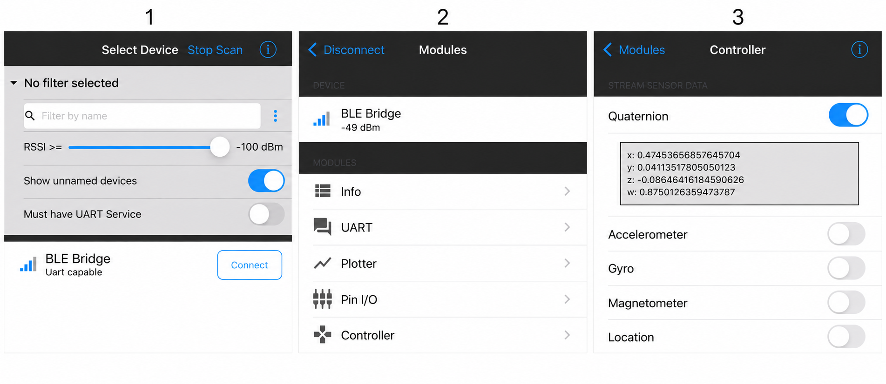

[English](README.md) | [日本語](README.ja.md)

[](https://github.com/renatus-novus-x/ble-motion-demo/actions/workflows/windows.yml)
[](https://github.com/renatus-novus-x/ble-motion-demo/actions/workflows/macos.yml)
[](https://github.com/renatus-novus-x/ble-motion-demo/actions/workflows/ubuntu.yml)

<p align="center">
  
</p>

ble-motion-demo
===============

<p align="center">
  <strong><a href="https://uraraworks.github.io/WebX68k/?cpu=10&amp;ram=12&amp;fd1=https://raw.githubusercontent.com/renatus-novus-x/ble-motion-demo/main/dist/ble-motion-demo.zip&amp;run=1">Launch ble-motion-demo in WebX68k</a></strong>
</p>

This demo was created to try connecting an X68000 to an iPhone through serial communication and BLE (Bluetooth Low Energy).
It receives motion data from the Bluefruit Connect app and rotates a white wireframe cube on screen as you tilt and turn the phone. Bluefruit Connect is available for both iOS and Android; see the [official app setup guide](https://learn.adafruit.com/bluefruit-le-connect/ios-setup).

The X68000 uses its serial port, while bridge software on Windows connects the serial link to BLE.
You can also try the demo in WebX68k, and desktop versions are available for Windows, macOS, and Ubuntu.

<details>
<summary>Supported platforms</summary>

| Platform | Graphics library |
| --- | --- |
| Windows | freeglut 3.4.0 / OpenGL |
| macOS | Apple GLUT / OpenGL frameworks |
| Ubuntu | freeglut 3.4.0 / OpenGL |
| X68000 / Human68k | OpenGL/GLUT-compatible API over IOCS 16-color graphics pages |

</details>

<details>
<summary>Run and controls</summary>

### Prepare the connection on Windows

For the first setup, open the [Windows COM9–BLE setup guide (PDF, Japanese)](docs/windows-com9-ble-setup.pdf) and follow the sequence below. These steps are shared by WebX68k running on Windows and the Windows desktop demo.

com0com is a Windows driver that creates a pair of connected virtual serial ports. Data written to one port can be read from the other. In this setup, the ports are named `COM9` and `BLE`. Here, `BLE` is a virtual port name; the ble-serial bridge handles the wireless connection.

```text
Bluefruit Connect → BLE wireless link → ble-serial → BLE-side port
                 → com0com → COM9 → WebX68k or the Windows demo
```

1. **Prepare the prerequisites (PDF p.2).** You need a Windows PC, a Bluetooth adapter capable of operating as a BLE Peripheral on Windows, and an iPhone or Android phone with Bluefruit Connect installed. The PC waits for a connection, and the phone discovers and connects to it.
2. **Install com0com.** The PDF assumes com0com is already installed. If it is not, consult the downloads and installation instructions on the [official com0com site](https://com0com.sourceforge.net/) before proceeding.
3. **Prepare the virtual port pair (PDF p.3).** Use an administrator PowerShell window to check existing ports before creating the `COM9` / `BLE` pair. Reuse the pair if it already exists. Do not reassign COM9 if another device uses it or create duplicate port names.
4. **Set up Python and the bridge (PDF pp.4–6).** In a normal PowerShell window, create the dedicated Python 3.11 virtual environment, install the library versions listed in the PDF, and apply its workaround.
5. **Start the BLE bridge (PDF p.7).** Run the prerequisite checks, then the Server startup command from the PDF. ble-serial opens the `BLE` side of the pair. After a successful startup message, leave that PowerShell window running. If you reopen PowerShell, repeat the `$blePython` assignment from PDF p.4. Commands that invoke Python through this variable require a leading `&`.

The UART terminal and `CTTY AUX` instructions on PDF p.8 are a separate text communication example. **Do not run `CTTY AUX` for this demo. Use the Controller steps below instead.**

### Try it in WebX68k

1. Complete the Windows setup above and leave the BLE bridge running.
2. Open the WebX68k link at the top of this page in a Web Serial-capable browser on the Windows PC. The disk starts the demo automatically and displays a stationary cube.
3. In WebX68k's serial connection settings, select `38400 bps` and connect to `COM9`, not the `BLE` side.
4. Follow the Bluefruit Connect steps below to send motion data from your phone.

Do not open COM9 in WebX68k and the Windows desktop demo at the same time. Disconnect the current application's serial connection before switching.

### Send motion data from Bluefruit Connect

The following iOS screen examples have been edited to replace the device name and remove nearby devices and status-bar information. The Android version may have a different layout or appearance.



1. **Select the device.** On the Select Device screen, find the BLE bridge on your Windows PC and tap `Connect`. `BLE Bridge` in the image is an example name. The actual name may be `WebX68k`, your Windows PC name, or another name; select your own bridge.
2. **Open Controller.** On the Modules screen, select `Controller`, not `UART`.
3. **Enable Quaternion.** Turn on the `Quaternion` switch. Quaternion data represents the phone's orientation. You do not need to enable the other sensors for this demo.

Tilt or turn the phone to rotate the cube. If it does not move, check that the BLE bridge is still running, the phone is connected to your PC, COM9 is connected at `38400 bps`, and Quaternion is enabled.

### Run a locally built executable

The desktop commands below assume that you have completed the build and install steps.
Windows without motion input:

```powershell
.\out\bin\ble-motion-demo.exe
```

For the minimal Windows setup connecting COM9 to the BLE-side virtual port with com0com, see the [Windows COM9–BLE setup guide (PDF)](docs/windows-com9-ble-setup.pdf).

Windows with com0com COM9 at 38400 bps:

```powershell
.\out\bin\ble-motion-demo.exe COM9 38400
```

macOS and Ubuntu without motion input:

```sh
./out/bin/ble-motion-demo
```

On macOS and Ubuntu, specify your serial device path and baud rate to receive motion input. Replace `/dev/tty.example` with the actual device path:

```sh
./out/bin/ble-motion-demo /dev/tty.example 38400
```

On X68000, start without arguments. The built-in RS-232C port is initialized automatically at a fixed 38400 bps (8N1, no flow control):

```text
bledemo.x
```

The packaged XDF runs this command automatically after Human68k starts.

- Desktop versions open a 512x512 window; the X68000 version uses a fixed 512x512 graphics area.
- Desktop versions preserve the cube's proportions when the window is resized.
- Press Esc or Q to quit.

</details>

<details>
<summary>Desktop build</summary>

Install CMake 3.21 or later and a C compiler.
On Windows, use Visual Studio with the Desktop development with C++ workload.
On macOS, use Xcode Command Line Tools.
Windows and Ubuntu also require Git. CMake downloads freeglut during configuration, so the first configuration requires network access.

Install the dependencies on Ubuntu:

```sh
sudo apt-get update
sudo apt-get install -y build-essential cmake git libgl1-mesa-dev libglu1-mesa-dev libx11-dev libxext-dev libxrandr-dev libxinerama-dev libxcursor-dev libxi-dev libxxf86vm-dev
```

From the cloned repository directory, use the same build commands on all three desktop platforms:

```sh
cmake -S . -B build -DCMAKE_BUILD_TYPE=Release
cmake --build build --config Release --parallel
cmake --install build --config Release --prefix out
```

</details>

<details>
<summary>X68000 build and distribution</summary>

### Set up Ubuntu 24.04 on WSL

On Windows, open PowerShell as administrator and install Ubuntu 24.04:

```powershell
wsl --install -d Ubuntu-24.04
```

Restart Windows if prompted, then open Ubuntu from PowerShell:

```powershell
wsl -d Ubuntu-24.04
```

On the first launch, follow the prompts to create a Linux username and password.
If Ubuntu 24.04 is already installed, skip installation and use the launch command above.
See the [official WSL installation guide](https://learn.microsoft.com/en-us/windows/wsl/install) for installation details.

### Install elf2x68k inside Ubuntu

Run the following in the Ubuntu shell. These instructions use the Linux archive from
[elf2x68k release 20260602](https://github.com/yunkya2/elf2x68k/releases/tag/20260602).
The packages also cover XDF and ZIP creation.

```sh
sudo apt-get update
sudo apt-get install -y bzip2 make curl ca-certificates python3 unar
cd "$HOME"
curl --fail --location --remote-name https://github.com/yunkya2/elf2x68k/releases/download/20260602/elf2x68k-Linux-20260602.tar.bz2
tar -xjf elf2x68k-Linux-20260602.tar.bz2 && rm elf2x68k-Linux-20260602.tar.bz2
```

Add the compiler directory to your login PATH once, then load the setting:

```sh
echo 'export PATH="$HOME/m68k-xelf/bin:$PATH"' >> "$HOME/.profile"
source "$HOME/.profile"
m68k-xelf-gcc --version
```

The single quotes preserve `$HOME` and `$PATH` in `.profile` so that they are
expanded when the file is loaded.

### Build the executable and disk images

In Ubuntu, change to the cloned repository directory and run make. Windows drives
are available under `/mnt/c`, `/mnt/d`, and so on. Replace the example path below
with your repository location:

```sh
cd /mnt/c/path/to/ble-motion-demo
make -f Makefile.x68k
```

The build generates:

- `dist/bledemo.x`: Human68k executable
- `dist/ble-motion-demo.xdf`: Bootable Human68k disk that runs `bledemo.x`
- `dist/ble-motion-demo.zip`: WebX68k-ready archive containing the XDF and the Human68k license

</details>

<details>
<summary>Automated builds and downloads</summary>

Separate GitHub Actions workflows build the Windows, macOS, and Ubuntu versions on pushes, pull requests, and manual runs. Build the X68000 version locally using the instructions above.
The badges at the top show the results of these three desktop builds.
Download executables from the Artifacts section of each run.
A successful build does not verify interactive GUI behavior.

</details>

<details>
<summary>Scope and goals</summary>

- Share rendering and motion packet decoding code across desktop platforms and X68000
- Keep the application simple and use C90-style syntax for easier porting to older systems
- Keep the X68000 IOCS renderer separate from desktop GLUT builds

</details>

<details>
<summary>File layout</summary>

- `src/main.c`: Serial polling, Bluefruit packet decoding, and cube rendering
- `src/platform.h`: Platform-specific serial port, clock, and sleep functions
- `src/x68k/GL/`: X68000-specific OpenGL/GLUT-compatible headers
- `src/x68k/glut.c`: X68000 OpenGL/GLUT-compatible IOCS rendering backend
- `CMakeLists.txt`: Build and graphics library configuration
- `Makefile.x68k`: X68000 cross-build configuration
- `scripts/patch_autoexec.py`: Human68k automatic-start configuration
- `scripts/make_sjis_zip.py`: Distribution ZIP creation
- `.github/workflows/windows.yml`: Windows build
- `.github/workflows/macos.yml`: macOS build
- `.github/workflows/ubuntu.yml`: Ubuntu build

</details>

<details>
<summary>Notes and limitations</summary>

- Select Quaternion in Bluefruit Connect's Controller sensor list. Valid `!Q` packets rotate the cube.
- Serial input is polled without blocking from `idle()`. Desktop versions wait for the time remaining before the next 1/60-second frame deadline. On X68000, `glutSwapBuffers()` waits for the next vertical display period before switching pages.
- The default baud rate is 38400 bps. Both ends must use the same value.
- The application uses C90-style syntax and draws eight vertices and twelve edges with `GL_LINES`.
- Apple's OpenGL/GLUT APIs are deprecated and may produce compiler warnings on macOS.
- Running on Ubuntu requires a desktop environment with OpenGL and X11 available.
- X68000 initializes and polls the built-in RS-232C port through IOCS. It uses a fixed 38400 bps setting; no port or baud arguments are accepted. Set the WebX68k serial connection to 38400 bps as well.
- X68000 configures the CRTC for approximately 60 Hz and synchronizes page changes to VDISP.
- `main.c` uses the same OpenGL/GLUT calls on every platform, including `glClear()`, `glBegin(GL_LINES)`, `glFlush()`, and `glutSwapBuffers()`.
- X68000 uses a separate OpenGL/GLUT-compatible backend and two 512x512 IOCS graphics pages in 16-color mode. Its `glClear()` erases only the previous edges recorded for the hidden page, while `glutSwapBuffers()` exchanges the visible and drawing pages at VDISP. No full-frame clear or software-framebuffer copy is performed per frame.

</details>
